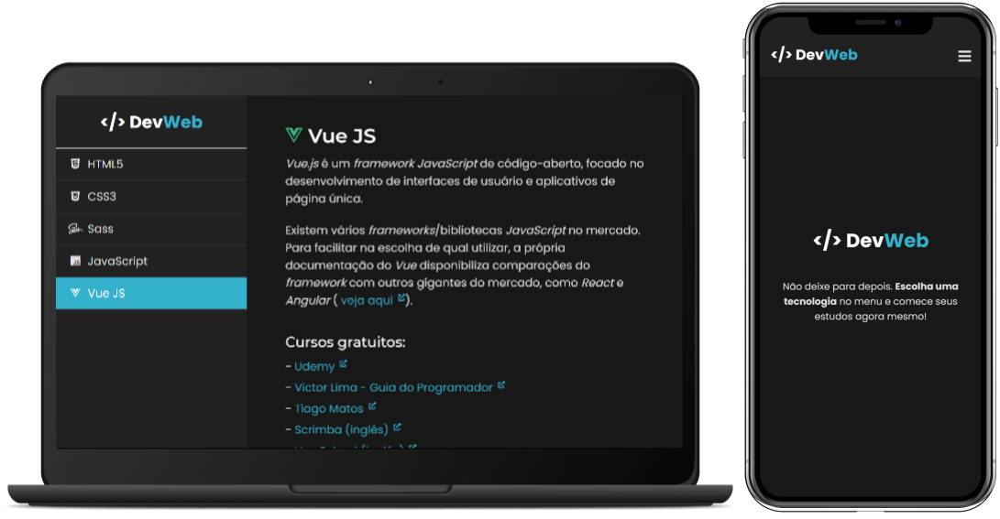

# DevWeb
Aplicação de página única (SPA) com roteiro de estudos de tecnologias para desenvolvimento web front-end.

Para testar a aplicação, [clique aqui](https://frontendev.vercel.app).

## Design


## Tecnologias Utilizadas
- [Vue.js](https://vuejs.org);
- [Vue Router](https://router.vue.org);

## Pré-requisitos
Antes de começar, você precisará das seguintes ferramentas instaladas em sua máquina:
- [NodeJS](https://nodejs.org/en);
- [Git](https://git-scm.com/);

## Instruções de Instalação e Execução
Com as ferramentas devidamente instaladas, execute os seguintes comandos:
```
# Clone o repositório
git clone https://github.com/filipealvess/DevWeb.git

# Entre na pasta do projeto
cd devweb

# Instale as dependências
npm install

# Execute a aplicação em modo de desenvolvimento
npm run serve
```
